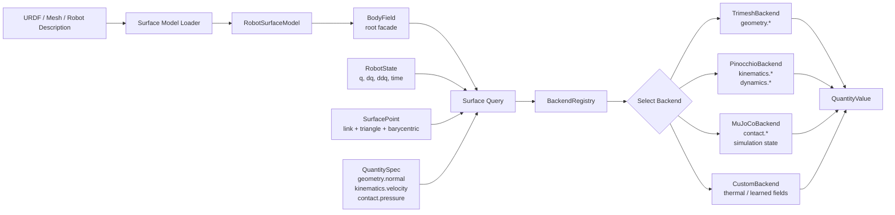
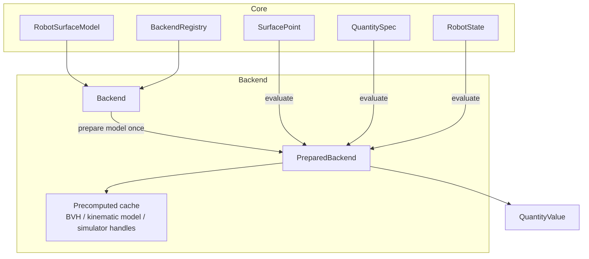

# Backend Interface Design

## Goal

URDF, mesh, or other robot surface descriptionsから得た表面モデルに対して、任意の表面点で任意の物理量を計算できるようにする。

このために、coreは以下だけを共通化する。

- robot surface modelの表現
- surface pointの表現
- quantity request / resultの表現
- backendの登録、選択、呼び出し

各backendは、対応できる物理量だけを実装する。

## Common Interface Example

```python
from dataclasses import dataclass, field
from typing import Any, Literal, Protocol


Vector3 = tuple[float, float, float]


@dataclass(frozen=True)
class SurfaceMesh:
    vertices: list[Vector3]
    faces: list[tuple[int, int, int]]


@dataclass(frozen=True)
class LinkSurface:
    link_name: str
    mesh: SurfaceMesh
    role: Literal["visual", "collision", "custom"] = "collision"


@dataclass(frozen=True)
class RobotSurfaceModel:
    name: str
    links: dict[str, LinkSurface]
    root_frame: str = "world"
    metadata: dict[str, Any] = field(default_factory=dict)


@dataclass(frozen=True)
class SurfacePoint:
    link_name: str
    position: Vector3
    frame: str
    triangle_id: int | None = None
    barycentric: tuple[float, float, float] | None = None


@dataclass(frozen=True)
class RobotState:
    q: Any | None = None
    dq: Any | None = None
    ddq: Any | None = None
    time: float | None = None


@dataclass(frozen=True)
class QuantitySpec:
    name: str
    output_type: Literal["scalar", "vector3", "tensor3", "matrix", "wrench", "custom"]
    frame: str | None = None
    unit: str | None = None
    params: dict[str, Any] = field(default_factory=dict)


@dataclass(frozen=True)
class QuantityValue:
    spec: QuantitySpec
    point: SurfacePoint
    value: Any
    frame: str | None = None
    unit: str | None = None
    metadata: dict[str, Any] = field(default_factory=dict)


class PreparedBackend(Protocol):
    def evaluate(
        self,
        points: list[SurfacePoint],
        quantities: list[QuantitySpec],
        state: RobotState | None = None,
    ) -> list[QuantityValue]:
        ...


class Backend(Protocol):
    name: str

    def supported_quantities(self) -> set[str]:
        ...

    def supports(self, model: RobotSurfaceModel, quantity: QuantitySpec) -> bool:
        ...

    def prepare(self, model: RobotSurfaceModel) -> PreparedBackend:
        ...

    def parallel_profile(self) -> ParallelProfile:
        ...
```

## Registry Example

```python
@dataclass(frozen=True)
class ParallelProfile:
    point_parallel: bool = False
    quantity_parallel: bool = False
    device: Literal["cpu", "gpu", "auto", "unknown"] = "unknown"
    backend_kind: str = "python"
    preferred_min_points: int = 0
    preferred_min_quantities: int = 0


class BackendRegistry:
    def __init__(self) -> None:
        self._backends: dict[str, Backend] = {}

    def register(self, backend: Backend) -> None:
        if backend.name in self._backends:
            raise ValueError(f"Backend already registered: {backend.name}")
        self._backends[backend.name] = backend

    def get(self, name: str) -> Backend:
        return self._backends[name]

    def select(
        self,
        model: RobotSurfaceModel,
        quantity: QuantitySpec,
        preferred: str | None = None,
        require_parallel_axis: Literal["points", "quantities"] | None = None,
    ) -> Backend:
        if preferred is not None:
            backend = self.get(preferred)
            if not backend.supports(model, quantity):
                raise ValueError(f"{preferred} does not support {quantity.name}")
            return backend

        for backend in self._backends.values():
            if backend.supports(model, quantity):
                return backend

        raise ValueError(f"No backend supports {quantity.name}")
```

並列化の軸は最初は2つに絞る。

```text
points parallel
  同じ物理量を多数の点で評価する。
  例: 1つの速度場を体表面10万点で評価する。

quantities parallel
  同じ点集合に対して複数の物理量を同時に評価する。
  例: position, normal, velocity, acceleration, pressureを同じ点でまとめて評価する。
```

backend選択では、この軸を明示的に要求できるようにする。

```python
values = field.evaluate(
    points,
    [QuantitySpec("kinematics.velocity", output_type="vector3", frame="world")],
    require_parallel_axis="points",
)
```

将来的には、`points` と `quantities` の両方を同時に満たすbackendを優先する。例えばTaichi/Warpは `points parallel`、JAX/PyTorchは `points parallel` と `quantities parallel` の両方に向きやすい。

## Usage Example

```python
registry = BackendRegistry()
registry.register(TrimeshBackend())
registry.register(PinocchioBackend())

model = load_urdf_surface_model("robot.urdf", mesh_role="collision")

point = SurfacePoint(
    link_name="left_foot",
    position=(0.04, 0.01, 0.0),
    frame="left_foot",
    triangle_id=120,
    barycentric=(0.2, 0.3, 0.5),
)

normal = QuantitySpec(
    name="geometry.normal",
    output_type="vector3",
    frame="world",
    unit=None,
)

velocity = QuantitySpec(
    name="kinematics.velocity",
    output_type="vector3",
    frame="world",
    unit="m/s",
)

backend = registry.select(model, normal)
prepared = backend.prepare(model)
values = prepared.evaluate([point], [normal])
```

## Root API Example

利用者が毎回 `BackendRegistry`, `select`, `prepare` を直接触らなくてよいように、APIの起点として `BodyField` のようなfacadeを用意する。

```python
class BodyField:
    def __init__(
        self,
        model: RobotSurfaceModel,
        registry: BackendRegistry | None = None,
    ) -> None:
        self.model = model
        self.registry = registry or default_backend_registry()
        self._prepared: dict[str, PreparedBackend] = {}

    def register_backend(self, backend: Backend) -> None:
        self.registry.register(backend)

    def at(
        self,
        point: SurfacePoint,
        state: RobotState | None = None,
    ) -> "SurfaceFieldQuery":
        return SurfaceFieldQuery(self, [point], state)

    def at_points(
        self,
        points: list[SurfacePoint],
        state: RobotState | None = None,
    ) -> "SurfaceFieldQuery":
        return SurfaceFieldQuery(self, points, state)

    def evaluate(
        self,
        points: list[SurfacePoint],
        quantities: list[QuantitySpec],
        state: RobotState | None = None,
        backend: str | None = None,
    ) -> list[QuantityValue]:
        results: list[QuantityValue] = []

        for quantity in quantities:
            selected = self.registry.select(self.model, quantity, preferred=backend)
            prepared = self._prepared_backend(selected)
            results.extend(prepared.evaluate(points, [quantity], state))

        return results

    def _prepared_backend(self, backend: Backend) -> PreparedBackend:
        if backend.name not in self._prepared:
            self._prepared[backend.name] = backend.prepare(self.model)
        return self._prepared[backend.name]


class SurfaceFieldQuery:
    def __init__(
        self,
        field: BodyField,
        points: list[SurfacePoint],
        state: RobotState | None,
    ) -> None:
        self.field = field
        self.points = points
        self.state = state

    def quantity(
        self,
        name: str,
        output_type: str = "custom",
        frame: str | None = None,
        unit: str | None = None,
        **params: Any,
    ) -> list[QuantityValue]:
        spec = QuantitySpec(
            name=name,
            output_type=output_type,
            frame=frame,
            unit=unit,
            params=params,
        )
        return self.field.evaluate(self.points, [spec], self.state)

    def normal(self, frame: str = "world") -> list[QuantityValue]:
        return self.quantity("geometry.normal", output_type="vector3", frame=frame)

    def velocity(self, frame: str = "world") -> list[QuantityValue]:
        return self.quantity(
            "kinematics.velocity",
            output_type="vector3",
            frame=frame,
            unit="m/s",
        )
```

このfacadeを使うと、利用側のコードは以下のように短くなる。

```python
field = BodyField.from_urdf("robot.urdf", mesh_role="collision")
field.register_backend(TrimeshBackend())
field.register_backend(PinocchioBackend())

point = field.project_to_surface(
    position=(0.2, 0.0, 0.1),
    frame="world",
    state=state,
)

normal = field.at(point, state).normal(frame="world")
velocity = field.at(point, state).velocity(frame="world")
temperature = field.at(point, state).quantity(
    "thermal.temperature",
    output_type="scalar",
    unit="K",
)
```

## Obstacle Distance Example

既知の障害物からリンク上の各点までの距離も、通常の `QuantitySpec` として扱う。
標準のNumPy実装では球とaxis-aligned boxを障害物として渡せる。

```python
from body_field import AxisAlignedBoxObstacle, BodyField, QuantitySpec, SphereObstacle
from body_field.backends import NumpyObstacleDistanceBackend

obstacles = [
    SphereObstacle("fixture", center=(0.8, 0.2, 0.0), radius=0.15),
    AxisAlignedBoxObstacle(
        "table",
        min_corner=(-0.5, -0.8, -0.1),
        max_corner=(1.2, 0.8, 0.0),
    ),
]

field = BodyField(model)
field.register_backend(NumpyObstacleDistanceBackend(link_state_provider, obstacles))

values = field.evaluate(
    points,
    [
        QuantitySpec(
            "geometry.obstacle.distance",
            output_type="scalar",
            frame="world",
            unit="m",
        ),
        QuantitySpec(
            "geometry.obstacle.vector",
            output_type="vector3",
            frame="world",
            unit="m",
        ),
    ],
    state=state,
)
```

`geometry.obstacle.distance` は最も近い障害物表面までの符号付き距離を返す。
`geometry.obstacle.vector` は最も近い障害物表面上の点からbody pointへのworld frame位置ベクトルを返す。
値が正なら障害物の外側、0なら接触、負なら障害物内部にある。
各 `QuantityValue.metadata` には `world_position`, `closest_obstacle`, `closest_point` が入る。

module-levelの関数群も用意できる。ただし、これは内部で `BodyField` を作る薄いラッパーに留める。

```python
def from_urdf(path: str, mesh_role: str = "collision") -> BodyField:
    model = load_urdf_surface_model(path, mesh_role=mesh_role)
    return BodyField(model, registry=default_backend_registry())


def evaluate(
    model: RobotSurfaceModel,
    points: list[SurfacePoint],
    quantities: list[QuantitySpec],
    state: RobotState | None = None,
    backend: str | None = None,
) -> list[QuantityValue]:
    return BodyField(model).evaluate(points, quantities, state, backend)
```

`BodyField` は便利な入口であり、backend interfaceそのものではない。backend実装者は引き続き `Backend` と `PreparedBackend` だけを満たせばよい。

## Whole Picture



## Backend Boundary



## Quantity Namespace

Quantity nameは固定enumにしすぎず、名前空間付き文字列にする。

```text
geometry.position
geometry.normal
geometry.nearest_point
geometry.signed_distance
geometry.curvature

kinematics.velocity
kinematics.acceleration
kinematics.jacobian
kinematics.manipulability.axes

dynamics.mass_matrix
dynamics.point_inertia
dynamics.wrench

contact.force
contact.pressure
contact.friction

thermal.temperature
stress.tensor
custom.*
```

## Design Notes

SurfacePointはworld座標だけで持たない。できる限り `link_name + triangle_id + barycentric` を保持する。

理由:

- 姿勢が変わっても同じ表面点を追跡できる
- 最近傍探索の曖昧さを減らせる
- 法線、接平面、面積重みなどの幾何量と相性がよい

ただしユーザー入力はworld座標でも受けたいので、coreに以下のような変換APIを置く。

```python
class SurfaceProjector(Protocol):
    def project(
        self,
        model: RobotSurfaceModel,
        position: Vector3,
        frame: str,
        state: RobotState | None = None,
    ) -> SurfacePoint:
        ...
```

## Minimal First Milestone

最初に作るべき範囲:

1. `RobotSurfaceModel`
2. `SurfacePoint`
3. `QuantitySpec`
4. `Backend`
5. `BackendRegistry`
6. `TrimeshBackend`
7. `geometry.normal`
8. `geometry.nearest_point`

この段階で、共通interfaceが「表面上の任意点に問い合わせる」という中核ユースケースを満たせるか検証する。

## Jacobian Backend

`kinematics.jacobian` は、robot kinematics provider が各 `SurfacePoint` に対して返す点ヤコビ行列を
`QuantityValue` として包む。標準実装の `NumpyPointJacobianBackend` は `PointJacobianProvider` から
1点につき1つの `3 x dof` 行列を受け取る。

```python
field.register_backend(NumpyPointJacobianBackend(jacobian_provider))

values = field.evaluate(
    points,
    [QuantitySpec("kinematics.jacobian", output_type="matrix", frame="world", unit="m/rad")],
    state=state,
    backend="jacobian.numpy",
)
```

同じ backend は `kinematics.manipulability.axes` も返せる。これは `J J^T` の固有値・固有ベクトルから、
可視化用の3本の軸ベクトルを作る。

## Meshcat Visualization

Meshcatで描画するために `body_field.visualization.MeshcatVisualizer` を用意する。

```python
from body_field.visualization import MeshcatVisualizer

meshcat = MeshcatVisualizer()
meshcat.clear()
meshcat.draw_surface_model(model, link_transforms=link_transforms)
meshcat.draw_points(position_values)
meshcat.draw_vectors(position_values, velocity_values, scale=0.18)
meshcat.draw_scalar_field(temperature_values)
meshcat.open()
```

サンプル:

```bash
python examples/meshcat_robot_quantities.py
```

このサンプルは、デフォルトでは2リンクの簡単な線リンクロボットをMeshcatに表示し、各リンク中心線上の点で物理量を計算する。

- ロボットリンク: 円柱
- 関節: 球
- サンプル点: 速度の大きさで色付けされたリンク上の点群
- `kinematics.velocity`: 世界座標系から見たオレンジの線分
- `kinematics.speed`: 速度ベクトルの大きさを青から赤のスカラー色で表示

体表面全体を覆う箱リンク表示も選べる。

```bash
python examples/meshcat_robot_quantities.py --geometry box
```

Meshcatサーバが既にある場合は既存サーバに接続できる。

```bash
python examples/meshcat_robot_quantities.py --zmq-url tcp://127.0.0.1:6000
```

## Link State And Point Field Split

リンク状態の計算と、リンク表面上の点ごとの計算は分離する。

```text
LinkStateProvider
  NumPy / Taichi / Pinocchio / Drake / MuJoCo / demo backend
  linkごとの world pose, twist, acceleration を計算

PointFieldBackend
  NumPy / Taichi
  SurfacePointごとの position, velocity, acceleration, speed を計算

PointJacobianBackend
  NumPy
  SurfacePointごとの 3 x dof point Jacobian を返す
```

共通のリンク状態:

```python
@dataclass(frozen=True)
class LinkState:
    link_name: str
    position: Vector3
    rotation: Matrix3
    angular_velocity: Vector3
    linear_velocity: Vector3
    angular_acceleration: Vector3 = (0.0, 0.0, 0.0)
    linear_acceleration: Vector3 = (0.0, 0.0, 0.0)
```

point-field backendは、同じ `SurfacePoint` と `QuantitySpec` に対して差し替えられる。

```python
field.register_backend(NumpyPointFieldBackend(link_state_provider))
field.register_backend(TaichiPointFieldBackend(link_state_provider, arch="cpu"))
```

比較用サンプル:

```bash
uv run python examples/compare_point_field_backends.py
```

現在は、箱リンク表面の2940点について以下を比較する。

```text
geometry.position
kinematics.velocity
kinematics.acceleration
kinematics.speed
```

Taichi backendでは、このうち点ごとの展開計算を `points parallel` として実行する。
